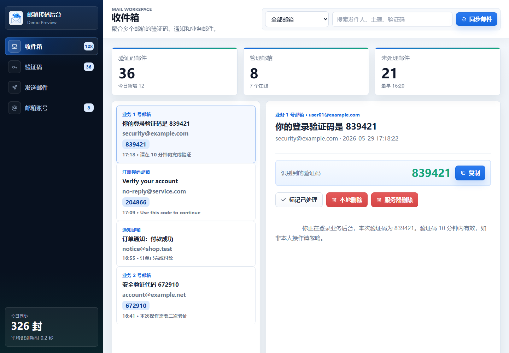
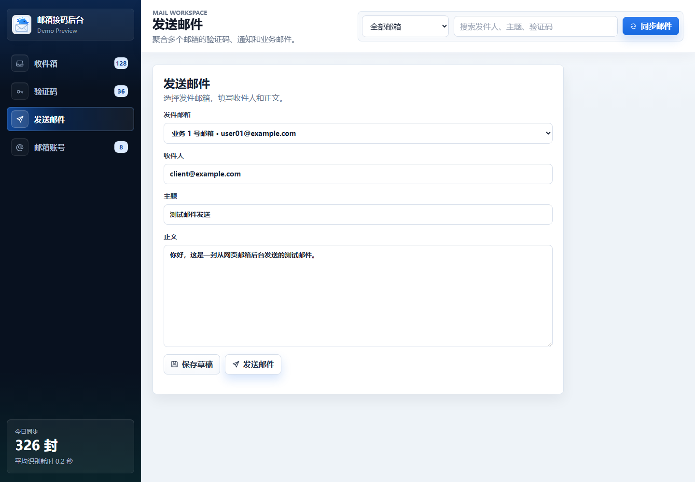
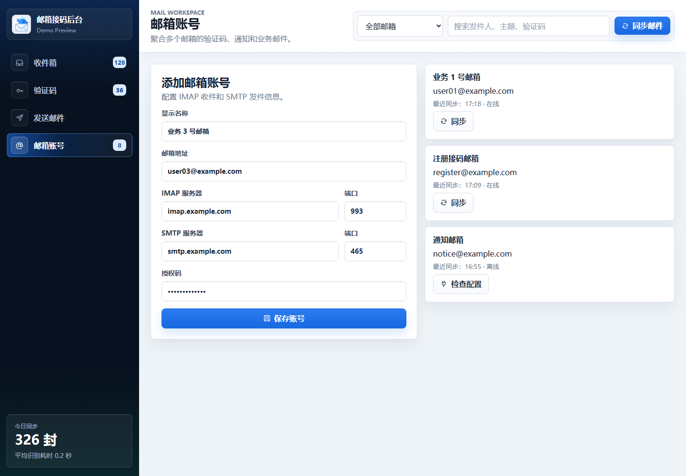

# 邮箱接码后台

这是我整理的一个本地邮箱验证码管理后台。它主要解决一个很具体的问题：手上有多个邮箱用来收验证码、注册通知或测试邮件时，不想来回登录不同邮箱，也不想在一堆邮件里手动翻验证码。

项目跑在本地，后端用 Python 标准库和 SQLite，前端是普通静态页面。启动后可以在浏览器里统一管理邮箱账号、同步收件箱、查看邮件、复制验证码，也可以用已配置的 SMTP 邮箱发信。

## 现在能做什么

- 添加多个邮箱账号，配置 IMAP 收件和 SMTP 发件。
- 测试单个邮箱配置是否可用。
- 手动同步单个邮箱或同步全部邮箱。
- 在收件箱里按邮箱和关键词筛选邮件。
- 自动从主题和正文里提取常见 4-8 位数字验证码。
- 查看邮件详情、复制验证码、标记已处理。
- 本地删除邮件记录，或删除服务器上的原始邮件。
- 使用已配置邮箱发送邮件。
- 通过 CSV 批量导入邮箱账号。
- 查看同步、登录、发信、删除等操作日志。

## 截图

### 收件箱



### 发送邮件



### 邮箱账号



## 本地启动

进入项目目录后直接运行：

```powershell
python server.py
```

默认地址：

```text
http://127.0.0.1:8088
```

默认账号：

```text
admin / admin123
```

第一次正式使用前，建议先改掉默认账号和密码：

```powershell
$env:MAIL_ADMIN_USER="你的管理员账号"
$env:MAIL_ADMIN_PASSWORD="你的强密码"
python server.py
```

也可以通过环境变量改监听地址和端口：

```powershell
$env:HOST="127.0.0.1"
$env:PORT="8088"
python server.py
```

## Docker 启动

仓库里保留了 Docker 配置。如果更习惯用容器，可以直接：

```powershell
docker compose up -d --build
```

停止服务：

```powershell
docker compose down
```

数据默认会落在本地 SQLite 文件里。正式使用时建议配合 `.env` 修改管理员账号、密码和端口。

## 邮箱账号怎么填

添加邮箱时需要填这些信息：

- 显示名称
- 邮箱地址
- IMAP 服务器和端口
- SMTP 服务器和端口
- 登录账号
- 邮箱密码或授权码

很多邮箱现在不允许直接用网页登录密码登录 IMAP/SMTP，需要先在邮箱网页端开启 IMAP/SMTP，然后生成“授权码”或“应用专用密码”。

常见服务可以参考：

```text
docs/provider-guides.md
```

## 批量导入

后台的“邮箱账号”页面可以下载 CSV 模板，也可以直接按下面的字段准备文件：

```text
name,email,imap_host,imap_port,imap_ssl,smtp_host,smtp_port,smtp_ssl,username,password
```

模板文件在：

```text
static/templates/account-import-template.csv
```

`imap_ssl` 和 `smtp_ssl` 可以填 `1` / `0`，也可以填 `true` / `false`。单次导入最多 500 个账号。

## 页面说明

### 概览

概览页用来看当前邮箱数量、邮件数量、验证码数量、待处理数量，以及最近同步情况和操作日志。

### 收件箱

收件箱会聚合所有已同步邮件。可以按邮箱筛选，也可以搜索发件人、主题、正文和验证码。点开邮件后，可以复制验证码、标记处理状态，或者删除邮件。

### 验证码

验证码页其实是收件箱的一个过滤视图，只看已经识别出验证码的邮件。

### 发送邮件

发送页会列出已配置的 SMTP 邮箱。选一个发件账号，填收件人、主题和正文就可以发送。

### 邮箱账号

这里负责维护邮箱配置。新增账号后可以先点“测试配置”，确认 IMAP 和 SMTP 都能连通，再同步邮件。

## 接口

项目没有引入额外框架，接口都写在 `server.py` 里。常用接口如下：

```text
POST   /api/login
POST   /api/logout
GET    /api/me

GET    /api/dashboard
GET    /api/logs

GET    /api/accounts
POST   /api/accounts
PUT    /api/accounts/{id}
DELETE /api/accounts/{id}
POST   /api/accounts/test
POST   /api/accounts/bulk
POST   /api/accounts/{id}/test
POST   /api/accounts/{id}/sync
POST   /api/sync-all

GET    /api/messages
GET    /api/messages/{id}
POST   /api/messages/{id}/processed
DELETE /api/messages/{id}

POST   /api/send
```

## 数据文件

默认数据库文件：

```text
mail_admin.sqlite3
```

这个文件只适合放在本机或内网环境里使用，不建议提交到仓库。邮箱授权码也会跟邮箱配置一起保存在本地数据库中，所以不要把数据库文件发给别人。

## 项目结构

```text
.
├── server.py
├── README.md
├── docs/
│   ├── provider-guides.md
│   ├── requirements.md
│   └── screenshots/
└── static/
    ├── index.html
    ├── styles.css
    ├── app.js
    ├── demo.html
    ├── demo.css
    ├── demo.js
    ├── icons.svg
    ├── logo-whale-envelope.svg
    ├── login-ops-visual.png
    ├── ui-prototype-dashboard.png
    └── templates/
        └── account-import-template.csv
```

## 备注

这个项目当前更适合本地或内网使用。如果要放到公网，需要再认真处理登录安全、数据库备份、授权码保护、HTTPS、访问限制等问题。
